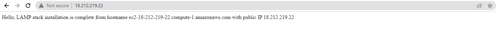
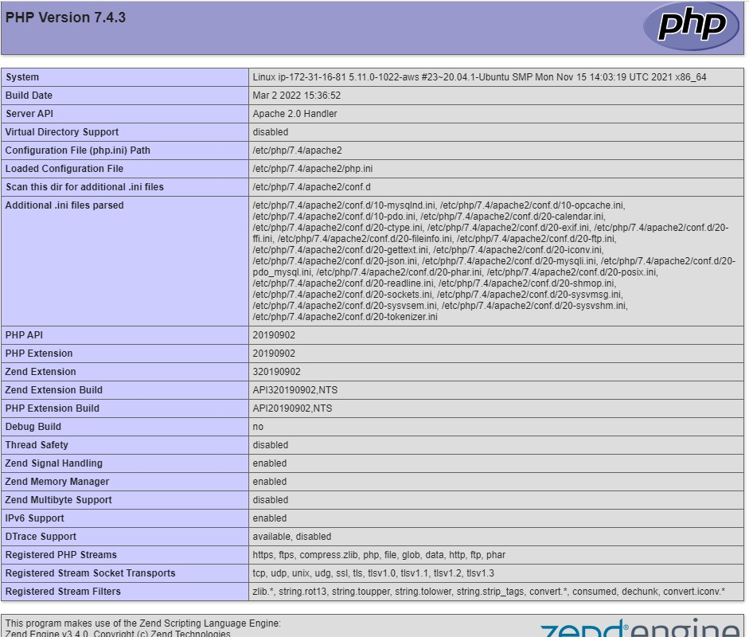

## Project 1 ##

### WEB STACK IMPLEMENTATION (LAMP STACK) IN AWS


#### LAMP (Linux, Apache, MySQL, PHP or Python, or Perl)
After successful completion of PBL project 1, you will be able to achieve the following.
Become very confident on the Linux Terminal

Deepen your understanding of Web Stacks and familiarity between the differences between the different Web Technology stacks such as LAMP.

Solid Linux administration skills in Storage management, NFS, troubleshooting, and basic networking

**Step 0** 

Provision an EC2 instance, name it *projectLAMP* 

Allow inbound traffic on port 22 for ssh connectivity


EC2 Instance


SSH Inbound Rule

Connect to the EC2 Instance


Instance connected

Update and Upgrade Ubuntu installation by running

```
sudo apt update -y && sudo apt upgrade -y
```

### **STEP 1 — INSTALLING APACHE AND UPDATING THE FIREWALL**
Apache HTTP Server is the most widely used web server software. Apache is an open source software available for free. It runs on 67% of all webservers in the world. It is fast, reliable, and secure. It can be highly customized to meet the needs of many different environments by using extensions and modules.

Install Apache using *apt* which is package (software) manager used in Ubuntu and some other Linux istributions.

```
sudo apt install apache2
```

Verify if apache is running with

```
sudo systemctl status apache2
```
If you see a green *active (running)* then you have done everything correctly. 

Use

```
 curl http://localhost:80
or
 curl http://127.0.0.1:80
 ```
 to confirm if our new web server is working correctly. You should some HTLM codes on your terminal as an indication that the Apache web server is working okay.

You can also check the result on a browser by going to:

```
http://<Public-IP-Address>:80
```
Use this command on the terminal to obtain your public IP address

```
curl -s http://169.254.169.254/latest/meta-data/public-ipv4
```

You should see a similar page like below:


## **STEP 2 — INSTALLING MYSQL** ##

We need to install a Database Management System (DBMS) to be able to store and manage data for our site in a relational database. **MySQL** is a popular relational database management system used within PHP environments, so we will use it in our project.

Install MYSQL with
```
sudo apt install mysql-server -y
```

After installation, run the security script with this to ensure you have a secured database installation. Provide appropriate responses.

```
sudo mysql_secure_installation
```

The login with to the newly installed mysql database

```
sudo mysql
```
You should have something similar to the figure below


Exit MYSQL with

```
mysql> exit
```

## **STEP 3 — INSTALLING PHP** ##

PHP is the component of our setup that will process code to display dynamic content to the end user. In addition to the php package, you’ll need php-mysql, a PHP module that allows PHP to communicate with MySQL-based databases. You’ll also need libapache2-mod-php to enable Apache to handle PHP files. Core PHP packages will automatically be installed as dependencies.

To install these 3 packages at once, run: 

```
sudo apt install php libapache2-mod-php php-mysql
```
At this point, we have completed our LAMP stack installation

* [x] Linux (Ubuntu)
* [x] Apache HTTP Server
* [x] MySQL
* [x] PHP

## **STEP 4 — CREATING A VIRTUAL HOST FOR YOUR WEBSITE USING APACHE** ##

Create the directory for *projectlamp* in /var/www/ using ‘mkdir’ command as follows

```
sudo mkdir /var/www/projectlamp
```

Assign ownership of the directory with your current system user:
```
sudo chown -R $USER:$USER /var/www/projectlamp
```

Then, create and open a new configuration file in Apache’s sites-available directory using your preferred command-line editor. Here, we’ll be using *vi or vim or nano* (any one you are convinient with):
```
sudo nano /etc/apache2/sites-available/projectlamp.conf
```
Copy the paste the code below into the empty file

```
<VirtualHost *:80>
    ServerName projectlamp
    ServerAlias www.projectlamp 
    ServerAdmin webmaster@localhost
    DocumentRoot /var/www/projectlamp
    ErrorLog ${APACHE_LOG_DIR}/error.log
    CustomLog ${APACHE_LOG_DIR}/access.log combined
</VirtualHost>
```
To safe the file,
1. Use **clrl+x**
1. Type **y**
1. hit **Enter**

You can use the ls command to show the new file in the **sites-available** directory

```
sudo ls /etc/apache2/sites-available
```
You should see
```
000-default.conf  default-ssl.conf  projectlamp.conf
```

With this VirtualHost configuration, we’re telling Apache to serve projectlamp using **/var/www/projectlamp** as its web root directory. If you would like to test Apache without a domain name, you can remove or comment out the options ServerName and ServerAlias by adding a # character in the beginning of each option’s lines. Adding the # character there will tell the program to skip processing the instructions on those lines.

You can now use *a2ensite* command to enable the new virtual host:
```
sudo a2ensite projectlamp
```
To disable Apache’s default website use a2dissite command , type:
```
sudo a2dissite 000-default
```

To make sure your configuration file doesn’t contain syntax errors, run:
```
sudo apache2ctl configtest
```
You will get a **"Syntax OK"** message

Finally, reload Apache so these changes take effect:
```
sudo systemctl reload apache2
```
Your new website is now active, but the web root /var/www/projectlamp is still empty. Create an index.html file in that location so that we can test that the virtual host works as expected:
```
sudo echo 'Hello, LAMP stack installation is complete  from hostname' $(curl -s http://169.254.169.254/latest/meta-data/public-hostname) 'with public IP' $(curl -s http://169.254.169.254/latest/meta-data/public-ipv4) > /var/www/projectlamp/index.html
```

Access the new website on 
```
http://<Public-IP-Address>
or
http://<Public-IP-Address>
```

Sample website

## **STEP 5 — ENABLE PHP ON THE WEBSITE** ##

With the default **DirectoryIndex** settings on Apache, a file named *index.html* will always take precedence over an index.php file. This is useful for setting up maintenance pages in PHP applications, by creating a temporary index.html file containing an informative message to visitors. Because this page will take precedence over the index.php page, it will then become the landing page for the application. Once maintenance is over, the index.html is renamed or removed from the document root, bringing back the regular application page.

To change this behavior, we need to edit the */etc/apache2/mods-enabled/dir.conf* file and change the order in which the *index.php* file is listed within the DirectoryIndex directive:
```
sudo nano /etc/apache2/mods-enabled/dir.conf
```
```
<IfModule mod_dir.c>
        #Change this:
        #DirectoryIndex index.html index.cgi index.pl index.php index.xhtml index.htm
        #To this:
        DirectoryIndex index.php index.html index.cgi index.pl index.xhtml index.htm
</IfModule>
```
Save the file and run
```
sudo systemctl reload apache2
```
Create a new file named index.php inside your custom web root folder:
```
sudo nano /var/www/projectlamp/index.php
```
This will open a blank file. Add the following text, which is valid PHP code, inside the file:
```
<?php
phpinfo();
```
Save the file and refresh the browser


If you can see this page in your browser, then your PHP installation is working as expected

After checking the relevant information about your PHP server through that page, it’s best to remove the file you created as it contains sensitive information about your PHP environment -and your Ubuntu server. You can use rm to do so:
```
sudo rm /var/www/projectlamp/index.php
```