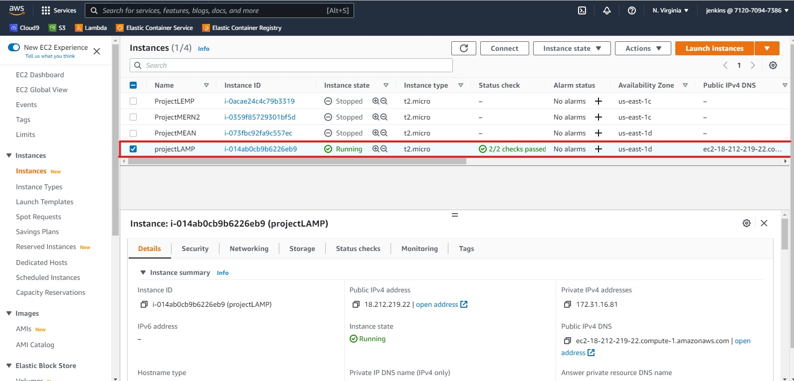
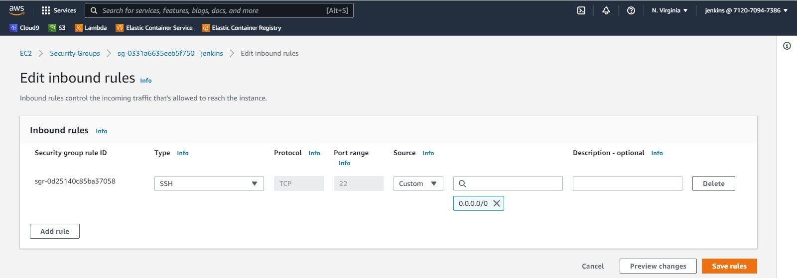
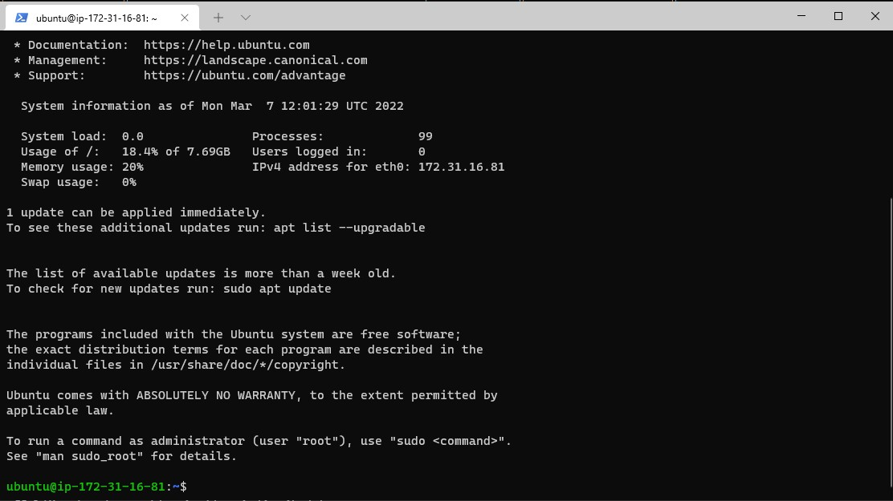
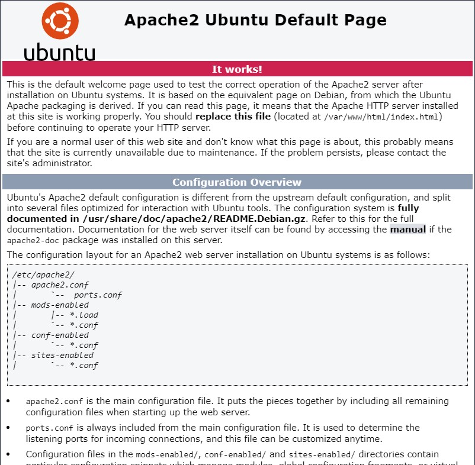
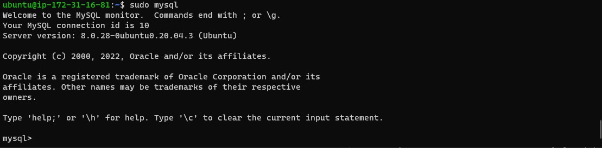

## Project 1 ##

### WEB STACK IMPLEMENTATION (LAMP STACK) IN AWS


#### LAMP (Linux, Apache, MySQL, PHP or Python, or Perl)
After successful completion of PBL project 1, you will be able to achieve the following.
Become very confident on the Linux Terminal

Deepen your understanding of Web Stacks and familiarity between the differences between the different Web Technology stacks such as LAMP.

Solid Linux administration skills in Storage management, NFS, troubleshooting, and basic networking

**Step 0** 

Provision an EC2 instance, name it *projectLAMP* 

Allow inbound traffic on port 22 for ssh connectivity


EC2 Instance


SSH Inbound Rule

Connect to the EC2 Instance


Instance connected

Update and Upgrade Ubuntu installation by running

```
sudo apt update -y && sudo apt upgrade -y
```

### **STEP 1 — INSTALLING APACHE AND UPDATING THE FIREWALL**
Apache HTTP Server is the most widely used web server software. Apache is an open source software available for free. It runs on 67% of all webservers in the world. It is fast, reliable, and secure. It can be highly customized to meet the needs of many different environments by using extensions and modules.

Install Apache using *apt* which is package (software) manager used in Ubuntu and some other Linux istributions.

```
sudo apt install apache2
```

Verify if apache is running with

```
sudo systemctl status apache2
```
If you see a green *active (running)* then you have done everything correctly. 

Use

```
 curl http://localhost:80
or
 curl http://127.0.0.1:80
 ```
 to confirm if our new web server is working correctly. You should some HTLM codes on your terminal as an indication that the Apache web server is working okay.

You can also check the result on a browser by going to:

```
http://<Public-IP-Address>:80
```
Use this command on the terminal to obtain your public IP address

```
curl -s http://169.254.169.254/latest/meta-data/public-ipv4
```

You should see a similar page like below:




## **STEP 2 — INSTALLING MYSQL** ##

We need to install a Database Management System (DBMS) to be able to store and manage data for our site in a relational database. **MySQL** is a popular relational database management system used within PHP environments, so we will use it in our project.

Install MYSQL with
```
sudo apt install mysql-server -y
```

After installation, run the security script with this to ensure you have a secured database installation. Provide appropriate responses.

```
sudo mysql_secure_installation
```

The login with to the newly installed mysql database

```
sudo mysql
```
You should have something similar to the figure below



Exit MYSQL with

```
mysql> exit
```

## **STEP 3 — INSTALLING PHP** ##

PHP is the component of our setup that will process code to display dynamic content to the end user. In addition to the php package, you’ll need php-mysql, a PHP module that allows PHP to communicate with MySQL-based databases. You’ll also need libapache2-mod-php to enable Apache to handle PHP files. Core PHP packages will automatically be installed as dependencies.

To install these 3 packages at once, run: 

```
sudo apt install php libapache2-mod-php php-mysql
```
At this point, we have completed our LAMP stack installation

* [x] Linux (Ubuntu)
* [x] Apache HTTP Server
* [x] MySQL
* [x] PHP